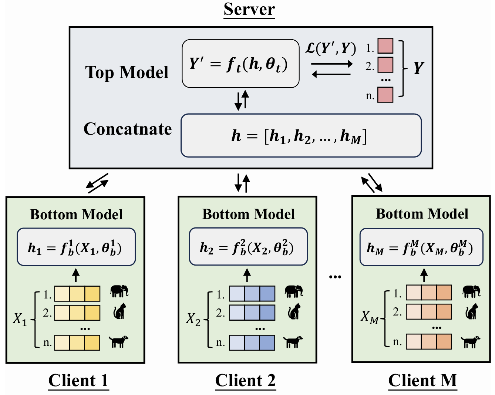
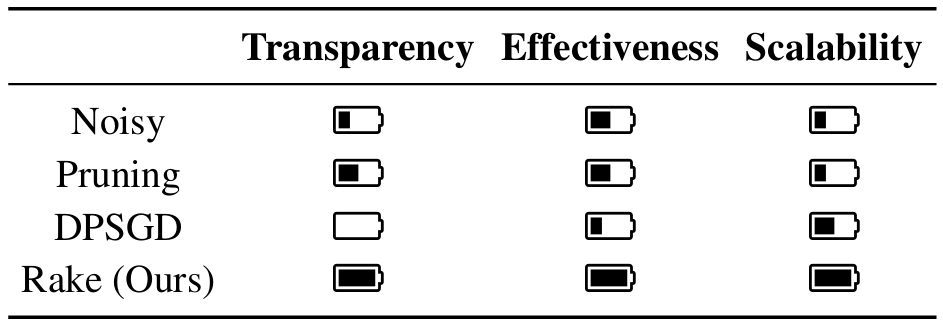
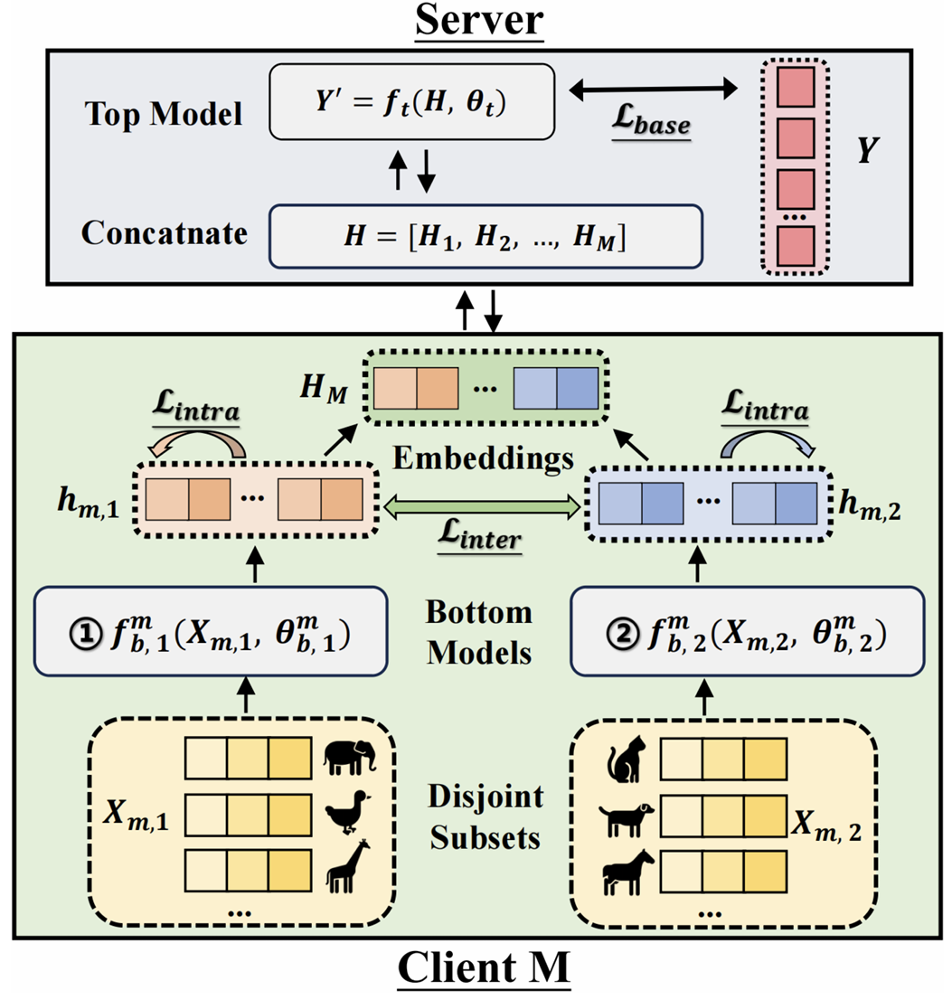
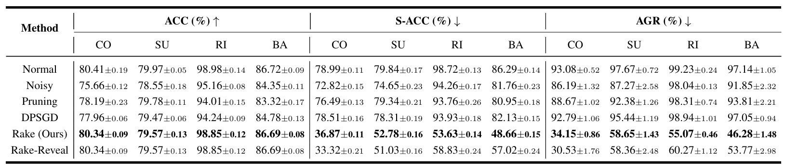
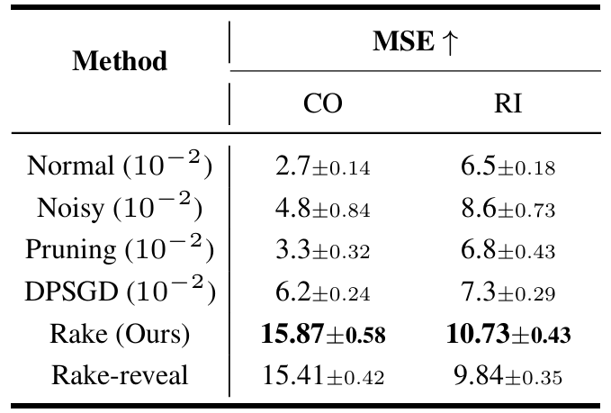

# Model Rake: A Defense Against Stealing Attacks in Split Learning

```
https://ieeexplore.ieee.org/abstract/document/11353031/
```

> 发表会议 IJCAI 2025

## 摘要

本文提出一种防御模型窃取和数据窃取攻击的方法 Model Rake：在 split learning 中，客户端不再只训练一个 bottom model，而是训练两个 bottom model，并用私有 hash 规则把样本固定分配给其中一个模型；同时通过额外损失让两个模型的 embedding 空间尽量不同。这样，恶意服务器看到的是两个不同映射混合后的 embedding，难以训练出一个准确的 surrogate model 来替代客户端模型，从而同时防御模型窃取和数据窃取攻击。

## 场景

模型被分为Bottom和Top两个部分分别保存在客户端和服务器端，目的是为了保护客户端侧的数据不被泄露。

1. 每个客户端用本地 bottom model 处理自己的特征；
2. 客户端把生成的中间表示发送给服务器；
3. 服务器拼接来自多个客户端的 embedding；
4. 服务器用 top model 得到预测结果并计算 loss；
5. 服务器反向传播梯度，并把对应梯度返回给客户端；
6. 客户端继续更新自己的 bottom model。



## 威胁模型

服务器：honest-but-curious，表面上正常参与训练，但会利用自己能观察到的信息推断客户端模型或数据。

### 攻击者已知信息

- 客户端上传的中间结果
- Top model
- 标签
- 辅助样本

### 攻击者未知信息

- 客户端原始数据
- 客户端 bottom model 参数

### 攻击目标

- 模型窃取 Model Stealing
- 数据窃取 Data Stealing

## 现有防御方法及其问题

论文比较了三类已有防御方法：

### 加噪（Noisy）

在客户端上传的 embedding 中加入高斯噪声。

优点：实现简单。
缺点：噪声太小，挡不住攻击；噪声太大，会损害主任务精度。

### 信息裁剪（Pruning）

裁剪掉 embedding 中幅值较小的元素。

优点：可以减少一部分信息泄露。 
缺点：攻击者仍然可以从剩余 embedding 中学习映射关系，而且裁剪可能降低正常模型性能。

### 对梯度进行差分隐私（DP-SGD）

训练时给客户端 bottom model 的梯度添加噪声。

优点：具有一定隐私保护思想。 
缺点：对模型窃取攻击的抑制有限，同时可能影响训练稳定性和精度。

### 本文认为好的防御方法应满足以下三个要求

- **Transparency**：不影响正常训练效果；
- **Effectiveness**：显著降低模型窃取和数据窃取成功率；
- **Scalability**：数据量变大、模型变复杂、客户端数量增加时仍然有效。



## 方法：Model Rake

### 核心思想

让客户端不再只有一个 bottom model，而是有两个 bottom model。

对于客户端 \(m\)，原本只有：
$$
f_b^m
$$
现在变成：
$$
f_{b,1}^m, \quad f_{b,2}^m
$$
每个样本通过客户端私有的 hash function，被固定分配给其中一个 bottom model。服务器不知道这个分配关系。

所以服务器看到的 embedding 实际来自两个不同模型的混合输出。



### 样本分配机制

每个客户端将自己的本地样本集合划分成两个不相交子集：
$$
X_{m,1}, \quad X_{m,2}
$$
其中：
$$
X_{m,1} \cap X_{m,2} = \emptyset, \quad X_{m,1} \cup X_{m,2} = X_m
$$
分配方式由客户端私有 hash 函数决定，并且在训练过程中保持固定。

这样做可以在保证训练稳定的同时防止服务器知道每个样本到底对应哪个 bottom model。

### 训练流程

对于一个 batch：

1. 属于子集1的样本送入 bottom model 1；
2. 属于子集2 的样本送入 bottom model 2；
3. 客户端把两个模型生成的 embedding 按原样本顺序重新排列；
4. 服务器接收所有客户端的 embedding；
5. 服务器完成拼接、预测、计算 loss 和反向传播；
6. 客户端分别更新两个 bottom model。

### Inter-model Contrast Loss

$$
L_{inter} = \sum_{i \in B_1} \sum_{j \in B_2} h_i^\top h_j
$$

目标：让两个 bottom model 产生的 embedding 尽量不同。

使用 cosine similarity 衡量两个模型输出之间的相似性，并惩罚跨模型 embedding 的相似，就是让两个 bottom model 尽量位于不同的 embedding 空间。

可以增加攻击者同时拟合两个模型的难度的同时防止攻击者的替身客户端用一个统一函数近似两个 bottom model。

### Intra-model Alignment Loss

$$
L_{intra}
= - \left(
\sum_{i,j \in B_1, i \ne j} h_i^\top h_j
+
\sum_{i,j \in B_2, i \ne j} h_i^\top h_j
\right)
$$

目标：让同一个 bottom model 内部的 embedding 尽量紧凑。

可以避免每个模型自己的 embedding 空间过于分散，否则两个模型的输出空间可能又会混在一起。

### 总损失函数

$$
L_{total} = L_{base} + \beta L_{inter} + \gamma L_{intra}
$$

Model Rake 的总损失由三部分组成：

- L_base：正常 split learning 的任务损失；
- L_inter：拉开两个模型输出空间；
- L_intra：压紧同一个模型内部的输出空间；
- β和γ是两个相加等于1的超参。

论文实验中默认设置：
$$
\beta = 0.6, \quad \gamma = 0.4
$$

## 理论分析：攻击者只能学到平均模型

攻击者训练一个替身模型，让它的输出尽量接近真实 embedding：
$$
\min_A \sum_{x \in S_1} \|Ax - A_1x\|^2 + \sum_{x \in S_2} \|Ax - A_2x\|^2
$$
在两个数据子集协方差矩阵相同等假设下，其最优解为：
$$
A = \frac{A_1 + A_2}{2}
$$
也就是说，攻击者如果不知道样本属于哪个 bottom model，那么训练出来的替身模型会倾向于两个 bottom model 的平均。

## 防御效果

### 模型窃取防御效果



### 数据窃取防御效果



### Rake-Reveal

Rake-Reveal 假设攻击者知道客户端使用了双 bottom model，但不知道样本分配方式。

实验显示，即使攻击者知道防御机制，Rake 仍然保持较好的防御效果。

这说明 Rake 的安全性不完全依赖于“攻击者不知道方法”，而是依赖于样本分配不可见和两个模型输出空间差异化带来的结构性困难。

## 局限性

- 虽然论文考虑了 Rake-Reveal，但没考虑攻击者如果尝试先聚类 embedding、推断样本分配，再训练两个替身模型，防御是否仍然有效。
- 工程实现复杂且只适用于分类问题，每个客户端需要维护两个 bottom model，并设计私有稳定的样本分配机制。针对资源匮乏的客户端不友好，除了分类任务外的任务很难进行合适的样本分配。
- 安全性依赖样本分配隐藏，如果攻击者能推断出样本属于哪个 bottom model，防御效果可能会下降

