# Optimistic Verifiable Training by Controlling Hardware Nondeterminism

```
https://arxiv.org/pdf/2403.09603
```

## 摘要

​	作者认为目前大环境下很多模型会被外包给相应的公司进行训练，然而一些相关公司可能会在需训练的数据中混入有毒数据或在训练时进行一些攻击，因此提出了一种可由第三方审核员验证的训练方法。

## 现存的保证训练过程规范的一些方法

- 训练者向客户提供加密证明。这种技术在一些简单的任务中能用，但它会增加大量的训练时间，不适用于复杂任务。
- 求助第三方，即审核员。审核员训练同样的模型来对训练者是否进行了规范的训练进行验证，理想情况下，只要记录了训练步骤和检查点，审核员就能训练出相同的模型，然而即便如此，由于不确定性的影响，在不同的GPU下训练出来的权重也可能不同。
- 考虑硬件的解决方法。在受信任执行环境（TEE，是内存和 CPU 的一个隔离区，使用加密技术与 CPU 的其他部分隔离，TEE 中的任何数据都不能被该环境之外的任何代码读取或篡改，可以通过适当授权的代码在 TEE 中操作数据）中进行训练。这样审核员就只需检查代码和环境，无需进行训练，但是TEE中的训练会带来性能的不足，攻击者也可能会提取出GPU中的授权代码进行攻击。

## 本文提出的方法概述

​	主要是为了消除不确定性的影响，可以考虑让训练者和审核员都以彼目标精度更高的精度进行训练，再让所有浮点误差舍入到目标精度。但是直接应用这种方法是不行的，因为计算值若在舍入的边界，在不同的显卡上很有可能会浮动而跨越边界，导致其中一个向上舍入，另一个向下，这样就会滚雪球一样地发散。

​	考虑以上问题，本文决定记录每一个中间值（高精度）的舍入方向以方便训练者和审核员保持同步。不过这种方法理论上会记录大量数据导致需要大量的存储空间，因此本文还提出了减少记录数据的方法。

## 本文提出的方法

### 1.证明训练者的训练存在问题的方法

​	因为要证明训练者的训练存在问题的话需要指出这一问题的具体来源，比如具体的迭代次数，所以需要构建一颗Merkle Tree来存储检查点。树中的每一个叶节点是检查点的模型权重的哈希值，每一个非叶节点都是其子节点的哈希值。如果审核员构建的树的根节点与训练者相匹配则说明训练无误，若不匹配则可进行二叉搜索直到识别到 i 处叶节点匹配而 i+1 处不匹配。

### 2.消除不确定性的方法	

​	为了解决不确定性的影响，作者提出训练者和审核员的训练精度要高于客户的目标精度，例如从64位舍入到32位或者从32位舍入到16位之类的。但是直接舍入也可能会因训练环境的不同而出现偏差。

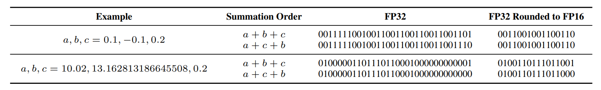

​	本文的方法是记录舍入的方向，即向上或向下，同时为了审核员的训练效率考虑，只在临界阈值中进行定向舍入。

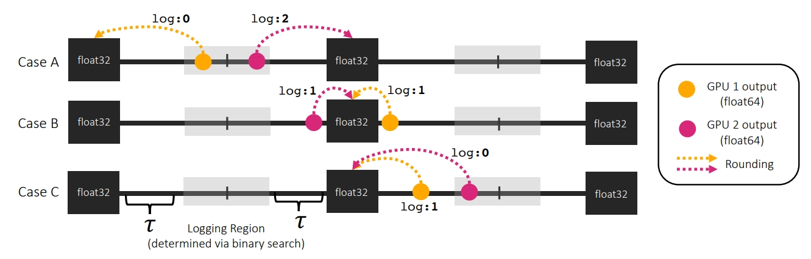

​	

​	τ即为无需定向舍入的部分，本文中记为1，需要定向向上舍入的记为2，向下的记为0，这些均记录到舍入日志中，写入和读取需进行I/O操作。

## 实验结果

​	作者通过ResNet-50和GPT-2两个模型进行测试，最终成功消除了不确定信，并且发现在舍入的位数更高时带来的效果不仅微乎其微，更会降低效率。而通过这种记录舍入的方式比传统的记录舍入的方式压缩了77%左右的空间。

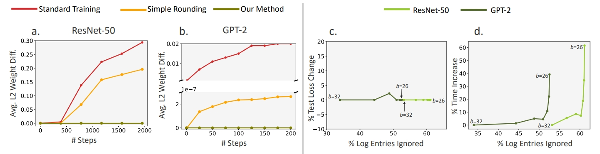

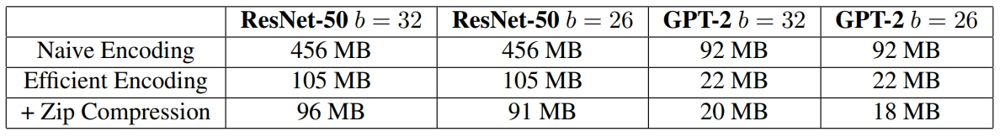

​	作者给出了方法所需的迭代时间与原始时间的对比，表明影响在可接受范围内。

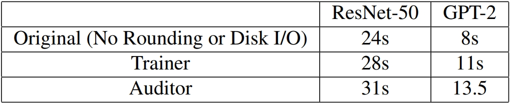

​	另外作者对比了不同参的自适应τ，发现卷积层的τ最小，说明不同的GPU输出相差较大，可能原因是矩阵乘法相对来说会有十分庞大的计算量。

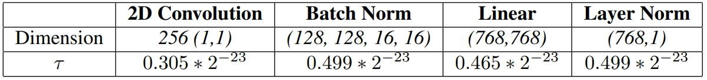

​	最后，本文给出了不同舍入位数下每一次迭代的平均校正次数，说明与记录的舍入次数相比，审核员实际上只需要很小一部分的记录值（在ResNet-50上约为2×10^-6%，GPT-2上约为9×10^-6%），而且更高位的舍入会完全消除任务的不确定性，即不需要校正。

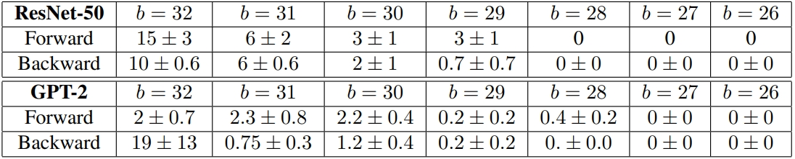

## 与其他方法的对比

​	基本都是几十倍甚至上百倍的提升。

## 算法简介

### Algorithm 1 舍入记录

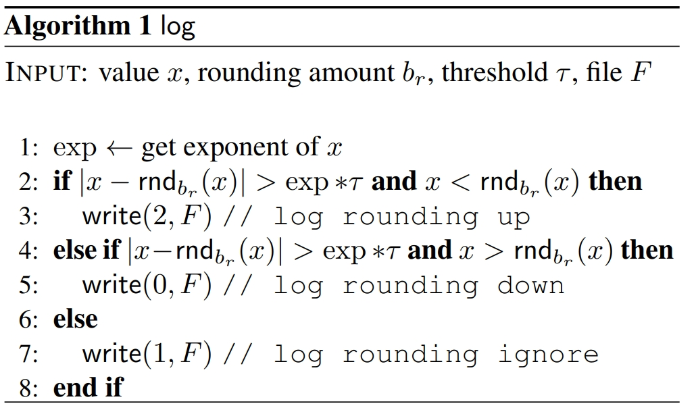

​	非常简单，就是之前那张图。

### Algorithm 2 训练过程记录

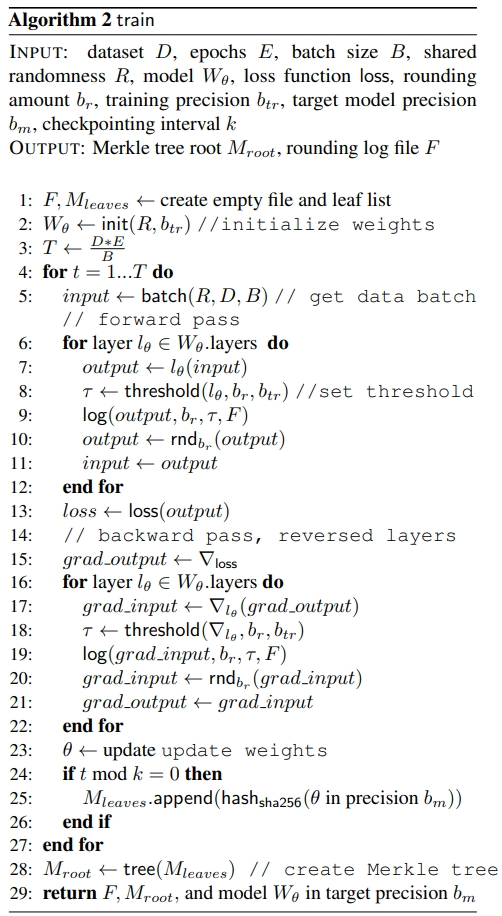

​	第3行是迭代次数；第8行是根据所在层，原精度和舍入精度得到τ；第9行是记录舍入log；第10行进行舍入操作。反向传播同理。

​	第24行是到了检查点，25行是记录检查点哈希值。

### Algorithm 3 审核员

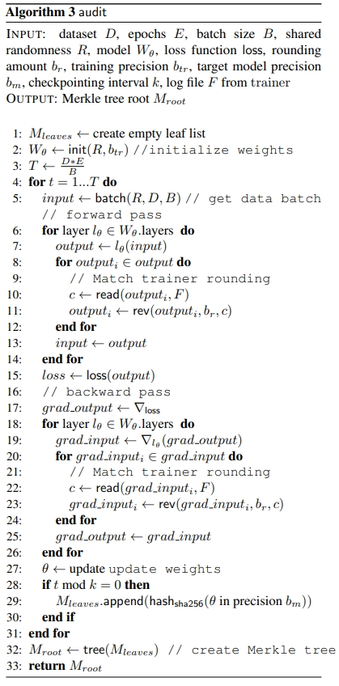

​	与算法2类似。第10行是读取训练者的log中对于该层该数据的舍入情况；第11行是进行舍入操作，rev函数是将outputi根据舍入情况舍入到第br位。

### Algorithm 4 τ的计算

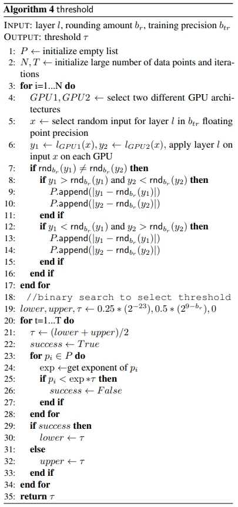

​	根据那张图来理解，这个算法本质上是一个二分查找。第6行是GPU1和GPU2在相同层的结果；第7到第17行的主要工作是如果两张显卡的舍入后的结果不一样，则将两个GPU的原始值其与舍入结果的差值记录到P中；第19行定义的lower是τ的下界，这里根据根据FP32的精度而定，意为若舍入结果与原结果的差值小于lower则无需记录舍入方向，upper是τ的上界，根据舍入目标位而定，意为若舍入结果与原结果的差值大于upper则需要记录舍入方向；最后几行就是如果存在P中的值比指数乘以τ小，则将τ赋予upper，否则将τ赋予lower，然后更新τ。