# Proof-of-Learning：Definitions and Practice

```
https://arxiv.org/abs/2103.05633
```

## 摘要

​	作者根据训练中的随机性，通过设置检查点，记录训练过程中的信息构建PoL。即各个检查点可以通过记录的信息训练到下一个检查点，只需在检查点进行校验。

## PoL定义

​	作者对一个有效的PoL的公式化定义如下：

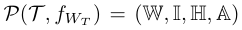

- T表式证明者，即训练者（V是验证者，未表式出）
- f_WT表示已训练的模型
- W表示训练过程中主要信息的集合（一般为权重）
- I用于获取特定位置的数据信息
- H是训练数据的哈希值
- A表示一些类似于loss函数、优化器之类的信息

## PoL属性

- G1：正确性：如果证明者通过从随机初始化的模型参数中训练模型从而获得该 PoL，直到它们收敛到 f_WT，则 f_WT 的 PoL 应该是可验证的。
- G2：安全性：如果对手A提供虚假的PoL，那么它有很高概率被检测到。
- G3：高效性：理想情况下，验证在计算上应该比生成证明计算成本更少。另外，在不同的设备上，验证理论上也能成功。
- G4：模型无关性：证明生成策略应具有通用性，适用于不同性质和复杂度的模型。
- G5：有限开销：生成证明应对已经计算成本高昂的训练过程产生有限的额外开销。
- G6：简洁证明：生成的证明数量远小于训练的步骤。

## 核心思想

- 逆推梯度下降过程（即给定最终权重和损失函数，找到之前的权重）在计算上是十分困难的，至少需要与正向训练过程相当的计算量，因此PoL难以伪造。
- 验证者通过重新执行部分选定的梯度下降步骤来验证PoL的正确性。由于逆推困难，验证者可以仅验证部分关键步骤，而无需验证整个训练过程，从而节省计算资源。

## 算法

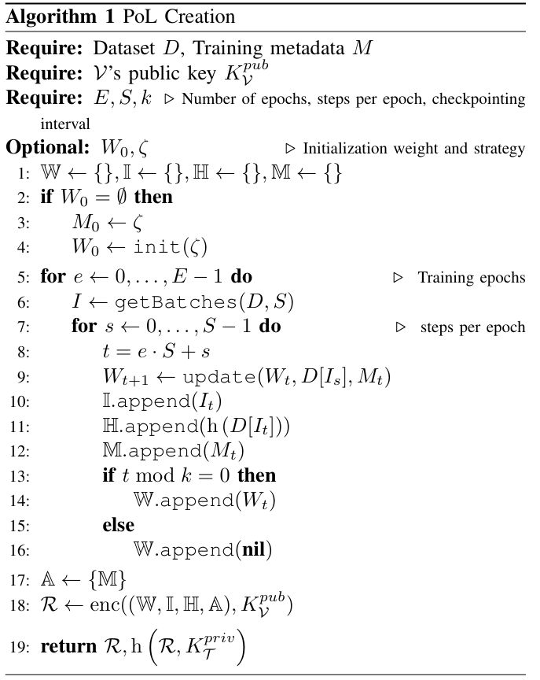

​	提供一个公钥用于加密，以及一个私钥进行签名。

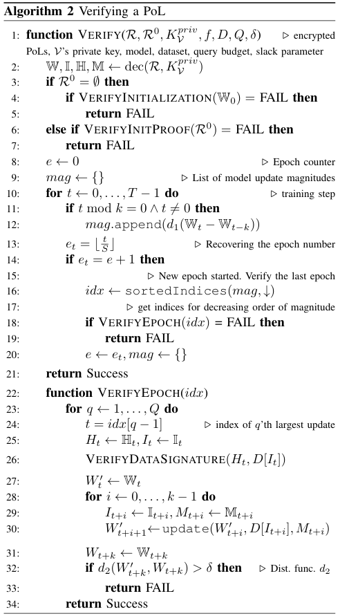

​	验证者首先检查证明者声称的模型初始化参数是否确实来自于声称的分布。可通过Kolmogorov-Smirnova测试来验证，以确保初始模型参数值确实符合随机分布。

​	当模型是从预训练的权重开始训练时，验证者会要求一个关于这些预训练权重的有效PoL（即P0）。这样，验证者可以建立一个链式信任，确保每一步的权重更新都是基于有效的先前状态，类似于一个递归操作，作者提到如果验证者已经记录了P0，则这就是一个记录查找。

​	在每个epoch结束时，验证者会从权重变化最大的几个更新开始验证。（作者认为小幅度更新一般是有效更新，幅度较大的可能有假的成分）验证者加载相应的数据点，执行梯度下降步骤，并比较得到的权重更新与证明者提供的更新是否在误差允许范围内一致。

​	作者说δ可以设置为训练期间几次梯度更新的平均值或者根据训练参数人为给定一个定值。

​	d1、d2是一种计算相似度的方法。

## 实验

​	作者在CIFAR-10和CIFAR-100上训练了ResNet-20和ResNet-50模型，并使用这些模型来验证PoL机制。

​	下图表示检查点间隔对证明的影响。

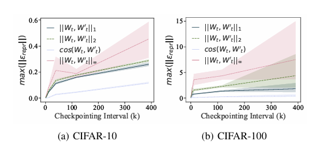

​	下图表示不同检查点间隔下的存储开销对证明的影响。

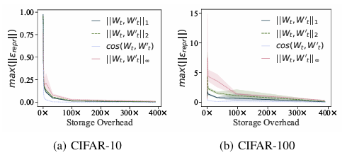

​	下图表示不同学习率对证明的影响。

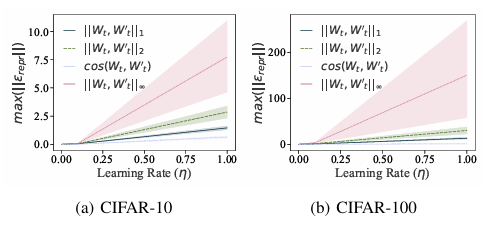

## 一些要点

- 引入了一种启发式方法，允许验证者只选择模型参数状态对的一个子集进行验证，从而在验证的置信度和成本之间进行权衡
- 建立链式信任，即每个PoL都需要伴随一个先前发布的证明来验证其初始状态

## 可抵御的攻击

- Retraining-based Spoofing：通过重新训练模型来生成有效的PoL，但这需要耗费大量的计算资源，且重训练的模型产生的PoL可能与原始PoL存在差异
- Stochastic Spoofing：攻击者试图创建一个有效的PoL，但这个PoL与原始的PoL不完全相同
- Structurally Correct Spoofing：攻击者可能构造一个结构上符合要求的PoL，但实际上并未经历真实的训练过程
- Distillation-based Spoofing：生成一个性能与原模型相近但内部参数不同的模型，PoL方法通过检查初始状态和训练过程中的特定数据点来防御这种攻击
- 重放攻击：训练者用验证者的公钥加密PoL，并使用自己的私钥签名，以防止重放攻击

总结出的其他攻击：

- 攻击者可能尝试通过逆梯度方法来重构PoL，即从模型的最终状态反向推算出训练过程中的中间状态，不过作者说这种方法和直接训练的工作量相同，很难所以攻击者一般不会使用该攻击方法，个人认为这种方法真的使用了的话应该是无法抵御的
- 攻击者可能尝试伪造一个看起来合理的初始化状态来欺骗验证者，而PoL方法要求提供初始状态的，因此可以规避
- 攻击者可能尝试将多个有效的但独立的PoL连接起来以创建看似连续的PoL，但是通过检验方法可以在检查点之间检验出显著的不连续性

## 谈谈

​	与Optimistic Verifiable Training相比，这个方法只需检查点已经允许一定的误差，效率上来说会高一点。但是很奇怪没给出允许误差范围的确定方法，只列举了几点可行的方法。然后作者也讨论了PoL机制对存储空间的需求，并提出通过数据格式转换（如float32到float16）来减少存储负担。

## 部分源码

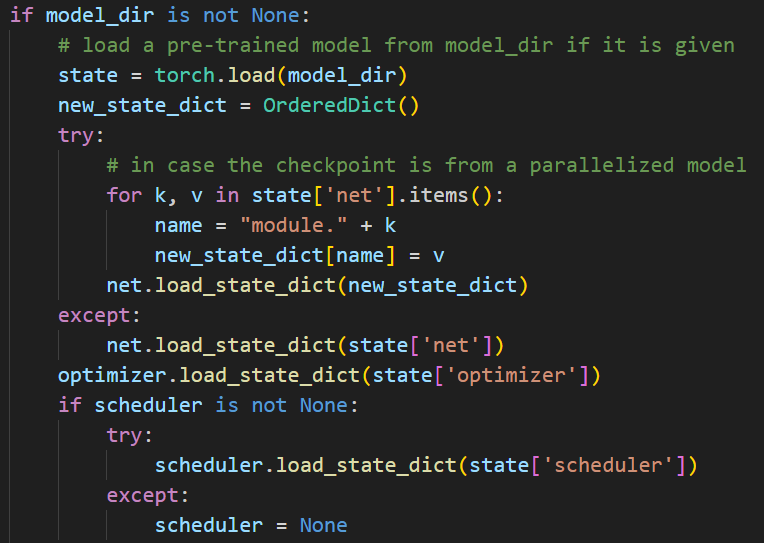

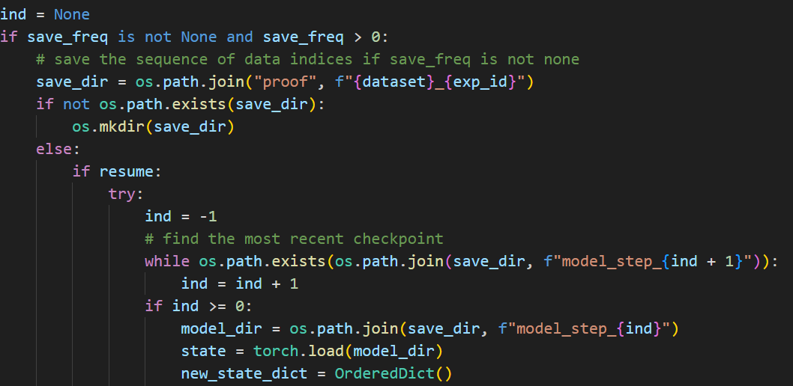

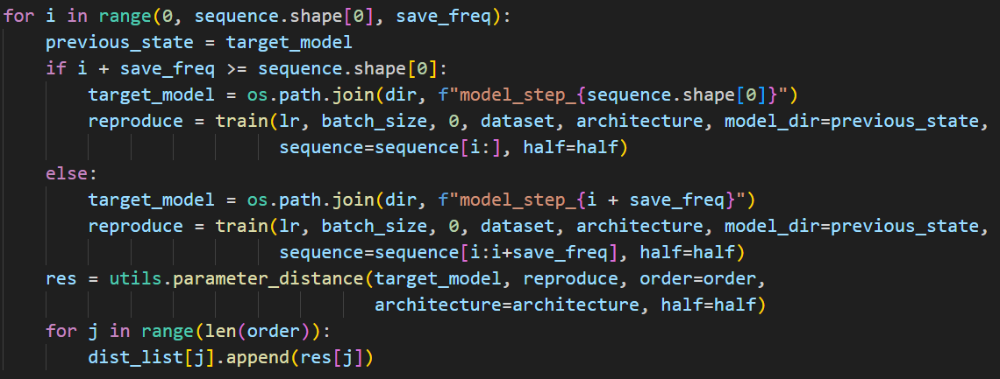

​	以上代码说明可以从预训练模型开始训练，对每个步骤，使用之前的模型状态重新训练一部分数据，解决了文中说的从几个检查点开始训练并检查结果的问题。

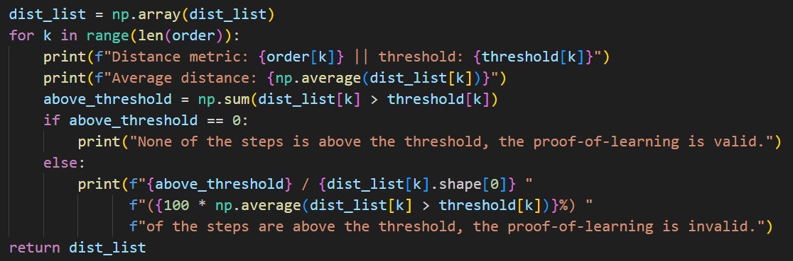

​	dist_list保存了每个步骤的距离。通过计算平均距离并与阈值比较，来判断整个学习过程的有效性。

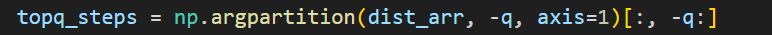

​	对每个 epoch，计算模型参数变化最大的q个步骤，仅对这些步骤进行重新训练和距离计算，以提高验证效率。
