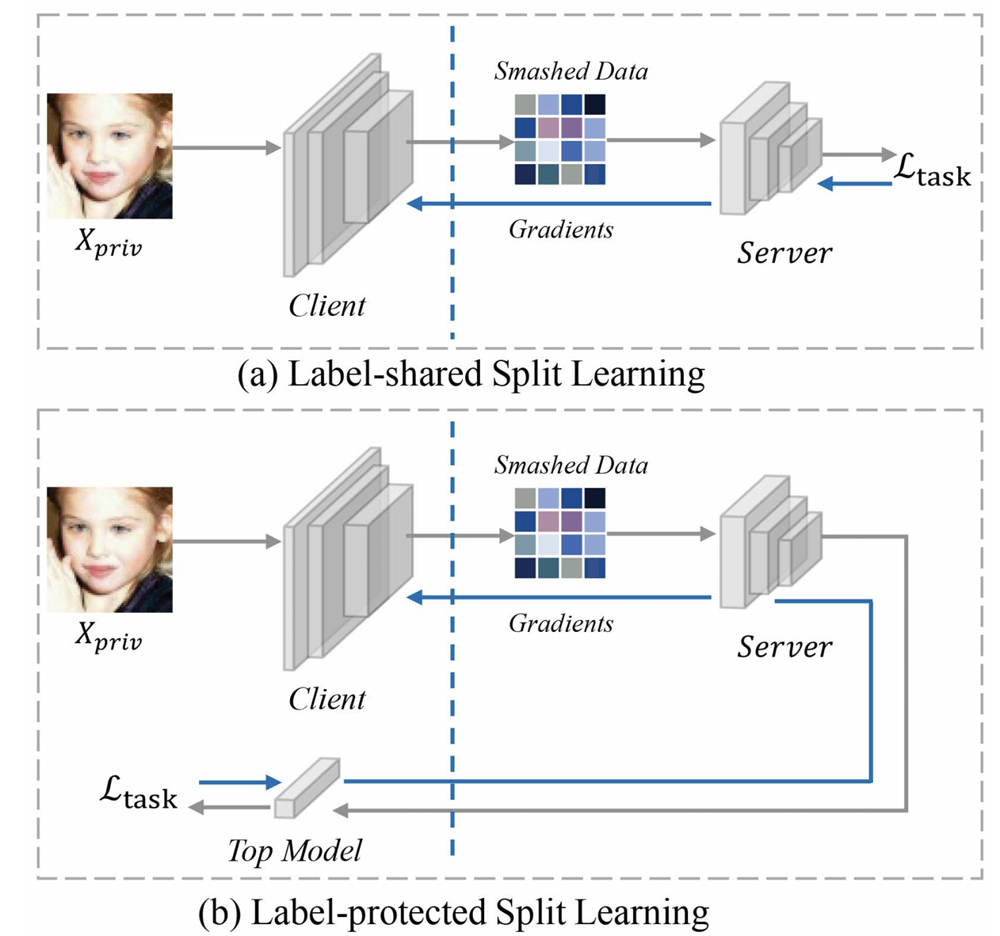
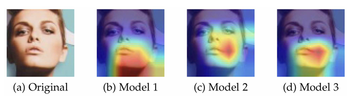
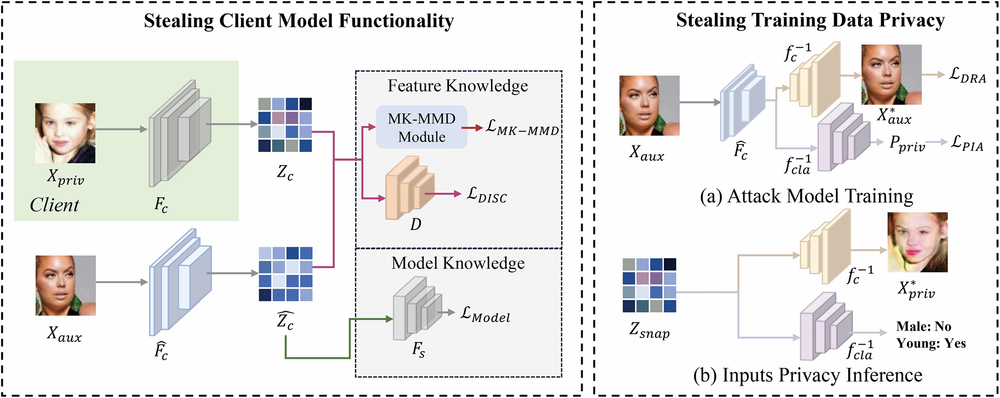
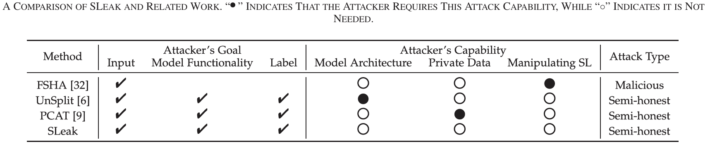
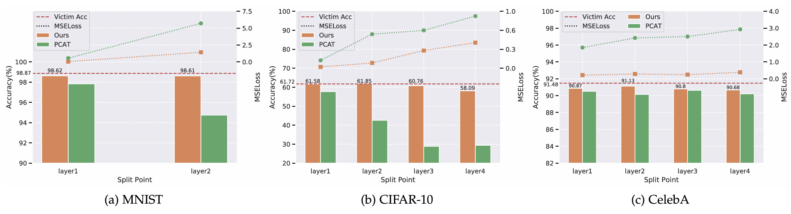
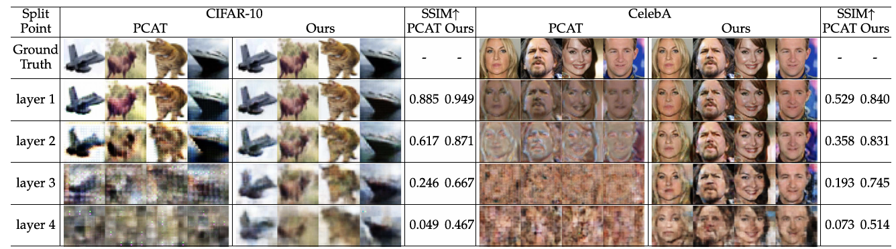
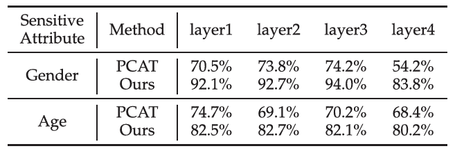
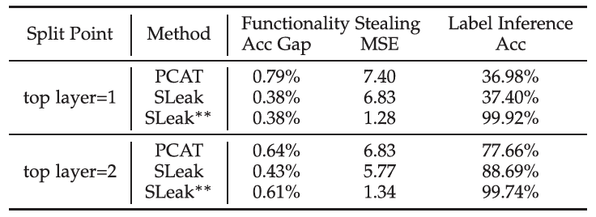

# SLeak Multi-Target Privacy Stealing Attack Against Split Learning

```
https://ieeexplore.ieee.org/abstract/document/11353031/
```

> 发表期刊 IEEE Transactions on Pattern Analysis and Machine Intelligence 2026

## 摘要

本文提出 SLeak，一种分割学习中的攻击手段，指出分割学习中客户端上传的中间数据和服务器模型都会泄露客户端的特征表示偏好。服务器即使不篡改训练流程，也可以利用公开辅助数据训练模拟客户端模型，从而窃取客户端模型功能、重建训练数据（DRA）、推断敏感属性（PIA），并在 label-protected 场景下进一步推断私有标签。该工作表明，SL 的隐私风险不仅来自原始数据是否上传，也来自中间特征和模型交互过程中泄露的表征行为。

## 场景

### 训练任务

图像分类问题

### 这篇论文中的 Split Learning



#### 场景1 Label-shared

模型由用户持有，分割为两个部分交由服务器进行训练。训练的label直接交给服务器，由服务器进行loss计算。

#### 场景2 Label-protected

模型由用户持有，分割为三个部分交由服务器进行训练。服务器不保留输入（inputs）和输出（outputs和loss计算）的模型部分，只保留中间部分。

### 本文的核心观点

本文认为，虽然服务器看不到原始输入，但它可以看到中间结果（smashed data）和部署在服务器的模型，他们均包含了客户端侧保存的模型的信息，而前者亦包含了用户输入数据的信息。

不同客户端训练同一任务时可能关注输入中的不同区域或通道，形成不同的中间特征分布。因此，服务器可以利用 smashed data 和服务器模型中隐含的信息，训练一个替身客户端模型来逼近真实客户端。



## 威胁模型

### 攻击者类型

攻击者是服务器，遵循以下规则：

- 遵守正常 SL 训练协议；
- 不主动篡改返回给客户端的梯度；
- 不破坏模型训练过程。

### 攻击者已知信息

- 正常 SL 训练过程中客户端上传的 smashed data；
- 自己持有的服务器模型部分；
- 一个公开的辅助数据集。

### 攻击者未知信息

- 客户端私有的任何训练数据；
- 客户端部分模型的任何信息；
- label-protected 场景下的私有标签。

### 攻击目标

- **功能窃取**：窃取客户端模型的功能；
- **数据重建**：从 smashed data 中恢复训练数据；
- **属性推断**：推断训练数据中的敏感属性。

## SLeak 方法详解

SLeak 的核心流程分为两个阶段：

1. 训练 substitute client，窃取客户端模型功能；
2. 基于 substitute client 训练攻击模型，窃取训练数据隐私。



### 阶段一：窃取客户端模型功能

服务器希望训练一个替身客户端模型：

$$
\hat{F}_c \approx F_c
$$
服务器利用两类知识来训练替身客户端模型部分：

- **Model Knowledge**：来自服务器已经拥有的模型部分；
- **Feature Knowledge**：来自客户端上传的 smashed data。

总优化目标为：

$$
\min_{\hat{F}_c} L_{Model} + L_{Feature}
$$

### Model Knowledge

将辅助数据（与客户端数据同域的公开辅助数据）输入 substitute client，再将其输出输入服务器模型：
$$
F_s(\hat{F}_c(X_{aux}))
$$
然后根据辅助数据标签计算任务损失：

$$
L_{Model} = L(F_s(\hat{F}_c(X_{aux})), Y_{aux})
$$
因为服务器的模型是和客户端的模型一起训练的，因此它偏好接收真实客户端风格的 smashed data。如果替身客户端输出的特征可以很好地被服务器模型使用，就说明替身客户端正在学习与真实客户端兼容的特征表示。

### Feature Knowledge

真实客户端特征为：
$$
Z_c = F_c(X_{priv})
$$
替身客户端特征为：
$$
\hat{Z}_c = \hat{F}_c(X_{aux})
$$
Feature Knowledge 的loss是：
$$
L_{Feature} = L_{DISC} + L_{MK-MMD}
$$

#### Domain Discriminator

Domain Discriminator \(D) 是一个判别器，用来区分某个 smashed data 来自真实客户端还是替身客户端。

训练目标是：

- 判别器可以区分真实客户端特征和替身客户端特征；
- 替身客户端尽量生成让判别器无法区分的特征。

#### MK-MMD

MK-MMD 用于显式度量两组特征分布之间的差异。

其目标是减小：
$$
\phi(\hat{F}_c(X_{aux}))
$$
和：
$$
\phi(F_c(X_{priv}))
$$
之间的距离。

MK-MMD 越小，说明替身客户端和真实客户端的特征分布越接近。


只使用 Model Knowledge 时，替身客户端可能在任务层面适配服务器模型，但其特征分布未必接近真实客户端。

只使用 Feature Knowledge 时，替身客户端可能在特征分布上接近真实客户端，但缺少任务目标的约束，对数据的窃取可能不稳定。

## 基于 substitute client 的隐私窃取

### DRA 数据重建攻击

服务器训练一个反演网络：
$$
f_c^{-1}
$$
其目标是将替身客户端产生的中间特征还原成原始输入：
$$
f_c^{-1}(\hat{F}_c(X_{aux})) \approx X_{aux}
$$
训练损失为：
$$
L_{DRA} = \left\| f_c^{-1}(\hat{F}_c(X_{aux})) - X_{aux} \right\|_2^2
$$
由于替身客户端的特征空间接近真实客户端，训练好的反演网络可以迁移到真实 smashed data 上：
$$
X_{priv}^{*} = f_c^{-1}(Z_{snap})
$$

### PIA 属性推断攻击

服务器还可以训练一个属性分类器：
$$
f_{cla}^{-1}
$$
服务器可以对真实 smashed data 进行属性推断：
$$
P_{priv} = f_{cla}^{-1}(Z_{snap})
$$

## SLeak**：面向 label-protected 场景的增强版本

在 label-protected 场景中，数据输入的模型部分（Bottom部分）和计算loss及输出outputs部分的模型（Top部分）都保留在客户端。服务器若要推断标签，需要额外训练 substitute top model：
$$
\hat{F}_t
$$
原始 SLeak 在该场景下可能出现过拟合问题，替身的Top部分对替身的Bottom部分提取的特征过度拟合，而不能很好泛化到真实客户端特征。

### 核心思想

采用分阶段训练策略：

1. 只使用 Feature Knowledge 训练替身的Bottom部分；
2. 冻结替身的Bottom部分；
3. 再使用 Model Knowledge 训练替身的Top部分。

### 标签推断

服务器通过训练的替身的Top部分可以推断私有标签：
$$
y_{priv}^{*} = \hat{F}_t(F_s(Z_{snap}))
$$
注意这里没有用到任何梯度。

## SLeak与其他攻击方法的对比



|    方法     | 核心思路                                                     | 需要的额外知识 / 操作                                        | 可攻击目标                             | 主要优点                                                     | 主要缺点                                                     |
| :---------: | ------------------------------------------------------------ | ------------------------------------------------------------ | -------------------------------------- | ------------------------------------------------------------ | ------------------------------------------------------------ |
|  **FSHA**   | 服务器操纵返回给客户端的梯度，把客户端输出的特征空间劫持到攻击者预训练 encoder 的特征空间，再用 decoder 重建输入 | 需要训练 autoencoder；需要主动控制梯度                       | 主要是数据重建                         | 重建效果可以较强                                             | 会破坏正常训练；容易被梯度检测方法发现；隐蔽性差             |
| **UnSplit** | 服务器训练一个 clone client，使其输出尽量接近真实客户端的 smashed data，再尝试恢复私有数据 | 通常需要知道客户端模型结构；依赖 smashed data                | 客户端功能窃取、数据恢复               | 不需要恶意篡改训练                                           | 搜索空间大；复杂数据集和复杂模型上效果较差；需要较强先验     |
|  **PCAT**   | 服务器利用自身模型信息训练 pseudo client，模拟真实客户端     | 需要访问一部分客户端私有训练数据                             | 功能窃取、数据重建、标签窃取           | 比 FSHA 更隐蔽，不破坏训练流程                               | 需要私有数据，假设不现实；对真实客户端特征空间的细粒度拟合不足 |
|  **SLeak**  | 同时利用 smashed data 中的 feature knowledge 和服务器模型中的 model knowledge，训练 substitute client 模拟真实客户端 | 不需要私有训练数据；不需要客户端模型结构；只需要同域公开辅助数据 | 功能窃取、数据重建、属性推断、标签推断 | 威胁模型更现实；攻击目标更多；同时适用于 label-shared 和 label-protected场景 | 仍依赖同域辅助数据；跨域场景效果不明                         |

### 实验对比

#### 模型功能窃取



#### DRA



#### PIA



#### Label-protected场景下对label的窃取



## 局限性

**依赖同域辅助数据**
SLeak 不需要私有数据，但需要与私有数据同域的公开辅助数据。若辅助数据与私有数据差异过大，攻击效果可能下降。

**其设计针对视觉任务**
论文主要在 MNIST、CIFAR-10、CelebA 等图像数据集上验证，是否能直接推广到 NLP数据还需要进一步研究。

**攻击效果与模型切分点强相关**
更深的切分点通常会增加攻击难度，尤其影响图像重建质量。