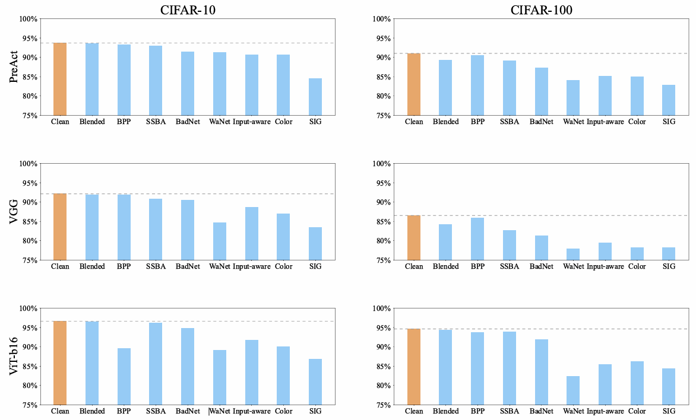
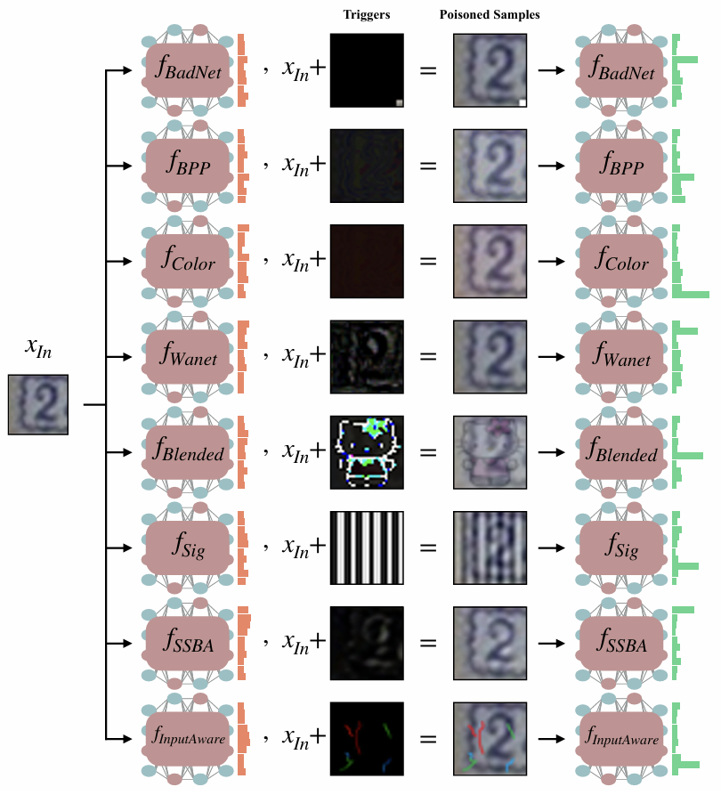
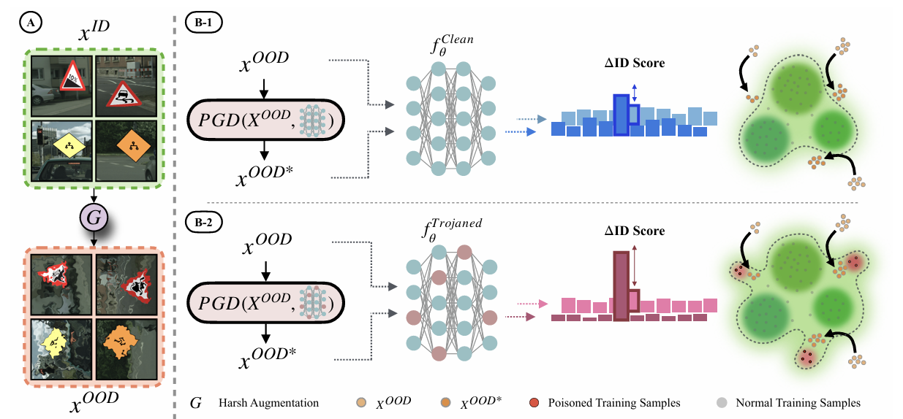
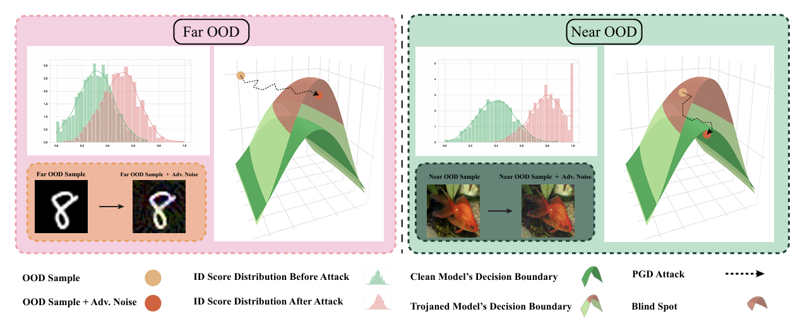
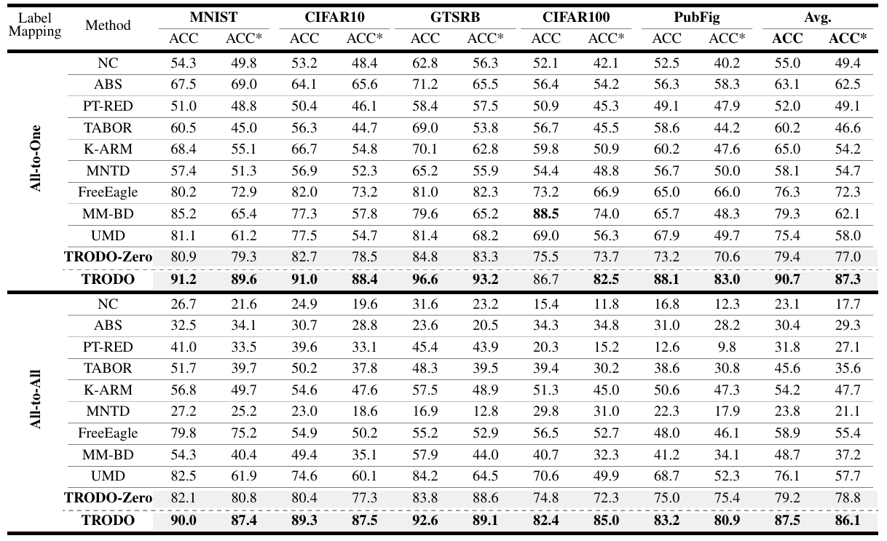
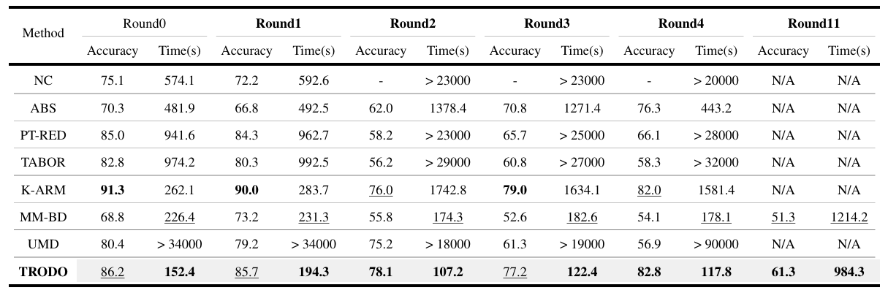

# 基于分布外样本的后门模型扫描方法

Scanning Trojaned Models Using Out-of-Distribution Samples

```
https://arxiv.org/abs/2501.17151
```

> **发表会议：NeurIPS 2024**

## 摘要

我们在拿到一个训练好的模型后，想判断它是否被植入后门。传统扫描器**依赖对攻击的强假设**，或者**只覆盖某些标签映射**（如一对一/一对多的映射是否正确）。简单来说，传统扫描器**依靠已知特征**，一旦攻击者做过对抗训练，这些特征会消失或被掩盖。论文中提出被植入后门的分类器在决策边界上会形成一些“**盲点**（blind spots）”——这些区域里本应是**分布外（OOD）**的样本，却更容易被模型当成**分布内（ID）**。利用这一普适现象，作者提出了**TRODO**（TROjan scanning by Detection of adversarial shifts in Out-of-distribution samples）方法，无需知道触发器、也不依赖具体的标签映射策略，甚至在无训练数据可用的情况下也能工作。

## 场景

A交给B训练一个模型，B训练模型的时候对正常的训练数据进行了修改，导致训练得到的模型带有“后门触发器”。

例：A让B训练一个识别牛和羊的模型，B用一个数据集进行训练，但是将其中的某个品种的牛的标签全部改成了羊，B训练好的模型几乎没问题（因为品种很多，所以综合看下来识别的几乎没有问题），但是那个品种的牛会被识别成羊（被植入了后门）。

## 威胁模型

攻击者可以通过**使用有毒训练数据**（poison training data）或**控制训练过程**来在模型中嵌入后门。触发器（trigger）可以是隐蔽的也可以是明显的，可能只作用于样本的一部分或整个样本。

## 防御者的能力

- **对模型的访问权限**：防御者对目标模型有**白盒**访问权限，可以读取模型参数/前向与反向计算结果。
- **数据权限**：防御者可能拥有一小批干净（同分布）的样本，也可能完全没有训练数据可用。论文中对应两种扫描模式：**TRODO（有少量干净样本可用）和 TRODO-Zero（无数据）**。
- **先验知识**：防御者**不需要**事先知道攻击类型、触发器形状或标签映射（即方法对攻击/触发器类型无先验依赖）。

## 核心理论

- 良性过拟合benign overfitting：被植入后门的模型拟合了一些**看似无意义的细节**，在后门触发器上容易**过拟合**。但是后门的触发器在整个测试集中含量会很少，甚至不出现，导致模型看起来很好。
- 植入了后门的模型通常**不是彻底崩坏**，只是因为额外学了触发器的特征，导致**边界有轻微扭曲**。
- 盲点blind spots：就是模型在输入空间中的一些区域，模型认为这些点属于某个类别，但其实它们离真实数据分布很远。后门模型因为**强行适应触发器**，会在特征空间里形成这些异常区域。是一种**后门攻击普遍存在的特征**，与攻击策略无关








## 概念

out of-distribution (OOD)：分布外的样本

in-distribution (ID)：分布内的样本

ID分数：可以用置信度表示，文中用的MSP（maximum softmax probability ）

## 方法概述

对 OOD 样本做轻微对抗扰动，如果模型被“推”得进 ID 区域（MSP 急升），说明模型存在这些盲点 → 高度可疑。

采用**对抗攻击**（使用了小幅对抗优化PGD）来**提高 OOD 样本的 ID 分数**，使其向训练数据分布移动。然后，测量 OOD 样本与其扰动后的对应样本之间**ID 分数的差异幅度**，称为**ID 分数差异**（∆ID-Score），并将其用作扫描后门的特征。当使用**近 OOD 样本**时，这一特征在区分干净模型与被植入后门的模型方面**更具判别力**。

用一组**近 OOD**（通过“强增强”得到的分布外样本）去**测试目标分类器**：对每个 OOD 样本做PGD，看模型的 ID-置信度（max softmax）能被提升多少。若平均提升很大，说明模型存在“盲点”→ 判为被植入后门；反之则为正常模型。



## 具体方法

> 注：TRODO-Zero相对于TRODO的不同在于没有训练集的数据，因此用的会是相似的数据。以下只描述TRODO。（比如A让B训练一个区分牛羊的模型，TRODO中A有B的一部分训练集的数据当做检测数据，TRODO-Zero中A只有有自己的一些牛羊的数据可以用来当做检测数据）

### 1.构造近OOD样本

防御者有一小部分干净训练样本（Dv），从这些样本出发，应用一系列**强增强（hard transformations）**，生成近OOD样本（D_OOD）。

这些增强会让样本不再属于训练分布，但仍然在视觉上看起来像 ID 样本，即“看起来像训练数据，却在统计分布上不在边界内”。

> 例：颜色反转、对比度调整、模糊、噪声、随机裁剪等。

TRODO 定义一个增强集合（Ti为一种强增强）：
$$
\mathcal{T} = \{T_i\}_{i=1}^{k}
$$
对每个干净样本x，随机排列这些增强并顺序应用：
$$
x' = T_{j_k}( \ldots T_{j_1}(x) )
$$

> 论文中经验性地设置k = 3（即对每个数据执行三种强增强）。

这个过程用函数 G(⋅)表示（得到的x'就是 OOD 样本）：
$$
x' = G(x)
$$

###  2.得到 ID-Score

使用最大 softmax 概率（Maximum Softmax Probability, MSP）作为 “ID-Score”（其中fi(x)是模型在第i类的输出置信度。）：
$$
S(x) = \max_{i=1, \dots, C} f^i(x)
$$
含义：MSP 越高，模型越确信该样本属于某个已知类别 => 越像 ID。
 MSP 越低 => 越像 OOD。

### 3.对抗扰动（Adversarial Perturbation）

论文提出在 OOD 样本上做一个特殊的对抗攻击：不是改变标签，而是增加该样本的 ID-Score（MSP），也就是让模型更“相信”这些 OOD 样本是ID样本。

使用 PGD（Projected Gradient Descent）来生成扰动：
$$
x^* = \text{PGD}(f_\theta, x, \epsilon)
$$
其中ϵ是扰动限制幅度。

### 4.TRODO 生成签名（Signature）

对每个 OOD 样本x，计算：
$$
\Delta S_{ID} = S(x^*) - S(x)
$$
即对抗前后 MSP 的提升量。

然后取平均：
$$
S_{\text{mean}} = \frac{1}{|D_{OOD}|} \sum_{x \in D_{OOD}} \Delta S_{ID}
$$
TRODO 的 signature 就是Smean，反映模型“让 OOD 样本看起来像 ID” 的难易程度。

最后设置一个阈值τ（可以用一个类似的替身模型统计它的Smean得出）。

> 判断：
>
> - 若 Smean > τ => 模型被判为 Trojaned；
> - 若 Smean < τ => 模型为 Clean。

### 5.阈值 τ 和扰动限制幅度 ϵ 如何取得

用替身模型 g 和近OOD样本 D_OOD，自适应求 ϵ（把 MSP 平均从 1/K 推到 γ = 0.5）。

ϵ 的定义是：能把 DOOD的平均 MSP 从 1/K 推到 γ 的最小扰动（在一个干净的替身分类器 g 上计算）；实现上用 DeepFool 的最小扰动估计。（δ为扰动量）
$$
\epsilon=\arg\min_{\delta}\|\delta\|_2\quad \text{subject to}\quad  \frac{\sum_{x\in D_{\text{OOD}}}\text{ID-Score}_g(x+\delta)}{|D_{\text{OOD}}|}\ge \gamma
$$


> OOD样本的 ID-Score（MSP） 一开始大致像均匀分布 U(K)，其值约为 1/K（K 是类别数）。作者把 MSP = 0.5 设为“边界置信度” γ，认为达此值就算“推到决策边界附近”


用 g 和 D_OOD 得到零假设分布，统计得到阈值 τ。

先在替身模型 g 与 D_OOD 上，批量算到基线签名集合：
$$
\{S_i(g,D_{\text{OOD}})\}_{i=1}^N
$$
把它看作零假设分布（干净模型的 signature 分布），对输入待测模型 f 算出 S(f, D_OOD))。若它相对基线分布是离群点，就判为植入了后门。

论文把 
$$
-\log(1-S_i(g,D_{\text{OOD}}))
$$
作为统计量，并给出阈值条件
$$
\Pr\!\Big(\max_{i=1..N}-\log(1-S_i(g,D_{\text{OOD}}))\le \tau\Big)>0.95
$$
由于≤左边的式子接近正态分布，论文用截断正态分布近似其分布函数 Φ(⋅)（标准正态的 CDF）。
$$
Pr(⋅)=[Φ(τ)]^N=0.95
$$
解得：
$$
\tau = \Phi^{-1}(0.95^{1/N})
$$

## 实验结果

> *为做了对抗攻击的





## 伪代码


